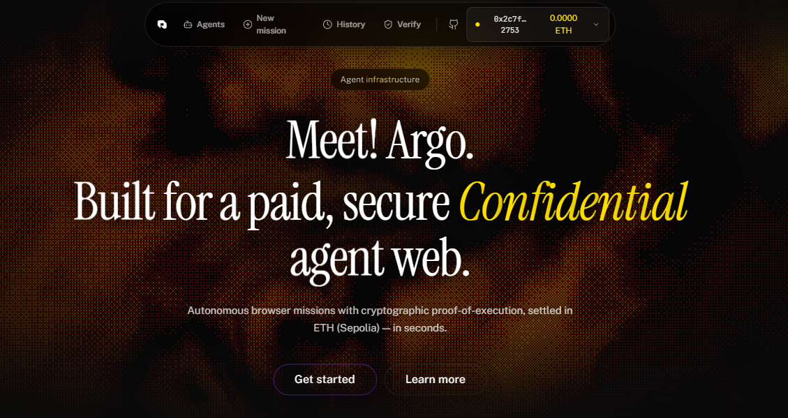

<a id="readme-top"></a>

<p align="center">
  
</p>

<h3 align="center">ARGO</h3>

<p align="center">
  Autonomous Web Agent Gateway. Multi-chain task settlement on Cardano Preprod and Ethereum Sepolia. Powered by iExec Nox.
  <br />
  <a href="./DEPLOY_VERCEL.md"><strong>Explore the docs »</strong></a>
  <br />
  <br />
  <a href="https://x.com/hemanttbuilds"></a>
  <a href="https://x.com/iEx_ec"></a>
</p>

<details>
  <summary>Table of Contents</summary>
  <ol>
    <li>
      <a href="#about-the-project">About The Project</a>
      <ul>
        <li><a href="#built-with">Built With</a></li>
      </ul>
    </li>
    <li>
      <a href="#getting-started">Getting Started</a>
      <ul>
        <li><a href="#prerequisites">Prerequisites</a></li>
        <li><a href="#installation">Installation</a></li>
      </ul>
    </li>
    <li><a href="#usage">Usage</a></li>
    <li><a href="#roadmap">Roadmap</a></li>
    <li><a href="#contributing">Contributing</a></li>
    <li><a href="#license">License</a></li>
  </ol>
</details>

---

## About The Project

Argo gives AI agents hands on the open web. Users describe a mission (for example: scan this URL, digest today's Hacker News, or watch a token price), pay an escrow fee, and Argo runs a headless browser agent that executes the task and returns a signed Proof-of-Execution.

To ensure privacy on-chain, Argo integrates the iExec Nox protocol. Sensitive data like target URLs, cookies, and login credentials are encrypted on the client side before the transaction is sent. This prevents private info from leaking on public block explorers. The runner only decrypts the payload inside a secure, off-chain Trusted Execution Environment (TEE) sandbox.

Key ideas:
* **Multi-Chain Escrows:** Supports both standard Solidity escrow settlement on Ethereum Sepolia and Cardano Preprod (via Masumi protocol).
* **iExec Nox TEE Confidentiality:** Client-side prompt encryption (XOR byte masking) protects target URLs, session cookies, and API credentials from public blockchain explorers, decrypting them only inside the secure off-chain execution enclave.
* **Neon Postgres:** Stores mission logs and history, scoped by wallet address.
* **Ed25519 Proof-of-Execution:** Generates cryptographically signed runs anchored on-chain for verifiability and non-repudiation.

<p align="right">(<a href="#readme-top">back to top</a>)</p>

### Built With

* [TanStack Start](https://tanstack.com/router/latest/docs/start/overview) (React 19 + Vite 7, SSR)
* [Tailwind CSS v4](https://tailwindcss.com/)
* [iExec Nox Protocol](https://docs.iex.ec/) (Sepolia)
* [Cardano CIP-30](https://cips.cardano.org/cip/CIP-0030/) + [Lucid Evolution](https://lucid.evolution-land.com/)
* [Steel browser automation](https://steel.dev/)
* [Cerebras inference](https://cerebras.ai/)
* [Neon Postgres](https://neon.tech/)

<p align="right">(<a href="#readme-top">back to top</a>)</p>

---

## Getting Started

### Prerequisites

* Node.js (v20+) or Bun (v1.1+)
* A browser wallet with MetaMask (Sepolia) or Cardano wallet (Preprod) connected
* Account API keys for: Steel, Cerebras, and Neon Postgres

### Installation

1. Clone the repository:
   ```bash
   git clone https://github.com/devndesigner6/argo-web.git
   cd argo-web
   ```

2. Install project dependencies:
   ```bash
   npm install
   ```

3. Create a Neon Postgres database project and run the schema initialization command:
   ```bash
   psql "$DATABASE_URL" -f src/lib/schema.sql
   ```

4. Create a `.env` file in the project root directory (copied from `.env.example`) and fill in:
   ```env
   DATABASE_URL=postgres://...
   SEPOLIA_RPC_URL=https://ethereum-sepolia-rpc.publicnode.com
   DEPLOYER_PRIVATE_KEY=your_private_key
   STEEL_API_KEY=your_steel_api_key
   CEREBRAS_API_KEY=your_cerebras_key
   ARGO_POE_SEED=your_poe_seed
   ```

5. Compile and deploy the smart contract to Sepolia automatically:
   ```bash
   node scripts/compile-and-deploy.cjs
   ```

6. Run the local development server:
   ```bash
   npm run dev
   ```

<p align="right">(<a href="#readme-top">back to top</a>)</p>

---

## Usage

1. Open the application and connect MetaMask (Sepolia) or a Cardano wallet (Preprod) in the top-right.
2. Pick an agent from the Agents page.
3. Fill out the "New mission" prompt details. Argo will show the escrow quote in ETH or ADA.
4. Toggle **Confidential Run (iExec Nox TEE)** if you want to encrypt the prompt input client-side before sending.
5. Sign the wallet intent and confirm the payment.
6. Watch the mission execution logs stream results and verify the Proof-of-Execution on the Verify page.

For production deployment on Vercel, see [DEPLOY_VERCEL.md](file:///c:/Users/hp/argo-masumi1/DEPLOY_VERCEL.md).

<p align="right">(<a href="#readme-top">back to top</a>)</p>

---

## Roadmap

- [x] Multi-chain payment support (Cardano Preprod + Ethereum Sepolia)
- [x] iExec Nox confidential data flows (Client encryption + TEE decryption)
- [x] Neon-backed mission history
- [x] Ed25519 Proof-of-Execution signing and verifier
- [ ] Long-running mission queue (Inngest / Trigger.dev)
- [ ] Mainnet deployment
- [ ] Agent SDK for third-party contributions

See open issues for a full list of proposed features and bug fixes.

<p align="right">(<a href="#readme-top">back to top</a>)</p>

---

## Contributing

Contributions make the open-source community an amazing place to learn, inspire, and create. Any contributions you make are greatly appreciated.

If you have a suggestion that would make this better, please fork the repo and create a pull request:

1. Fork the Project
2. Create your Feature Branch (`git checkout -b feature/AmazingFeature`)
3. Commit your Changes (`git commit -m 'Add some AmazingFeature'`)
4. Push to the Branch (`git push origin feature/AmazingFeature`)
5. Open a Pull Request

<p align="right">(<a href="#readme-top">back to top</a>)</p>

---

## License

Distributed under the MIT License. See `LICENSE` for more information.

<p align="right">(<a href="#readme-top">back to top</a>)</p>
